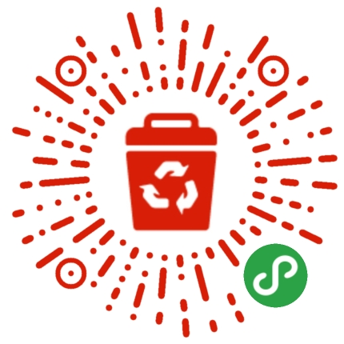
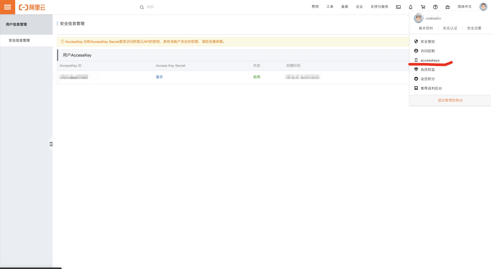
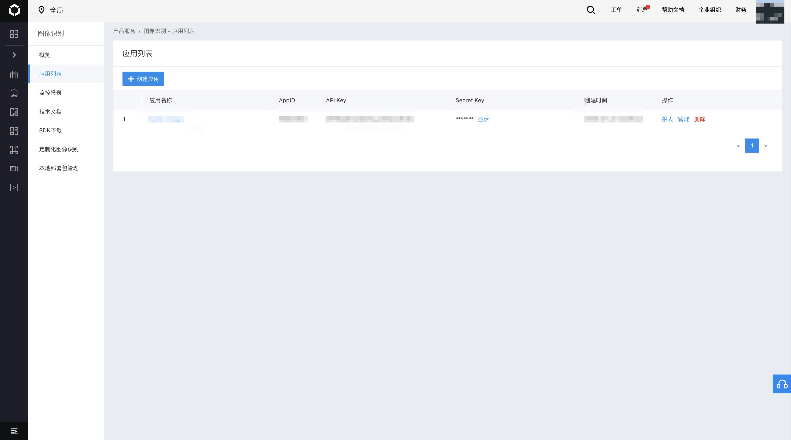
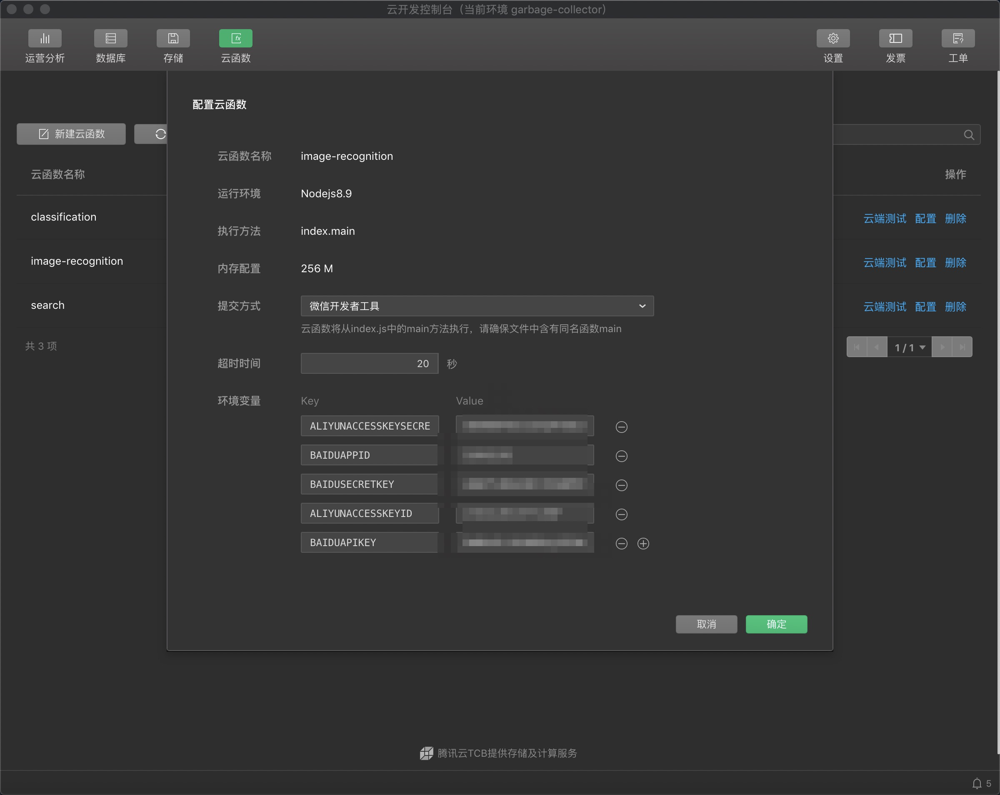

# garbage-collector

垃圾回收小助手

## 直接扫码体验

## 开发与部署

1. 修改`project.config.json`中的 appid 为自己的小程序 appid
2. 小程序使用云开发的方式进行的，所以需要开发者对于云开发有一定了解
3. 项目采用 taro 来开发的，所以需要了解 taro 相关的知识
4. 图像识别部分，图像识别集成了阿里云和百度云的图像识别 API，开发者可同时使用两种 API。但至少使用其中一个，否则会报错
   - 阿里云（阿里云图像打标）文档地址：https://help.aliyun.com/product/53258.html
   - 百度云（百度云图像识别）文档地址：https://cloud.baidu.com/doc/IMAGERECOGNITION/index.html
5. 服务端（云函数）环境变量：

   | key                   | 说明                        |
   | --------------------- | --------------------------- |
   | ALIYUNACCESSKEYID     | 阿里云 AccessKey ID         |
   | ALIYUNACCESSKEYSECRET | 阿里云 Access Key Secret    |
   | BAIDUAPPID            | 百度图像识别应用 AppID      |
   | BAIDUAPIKEY           | 百度图像识别应用 API Key    |
   | BAIDUSECRETKEY        | 百度图像识别应用 Secret Key |

   
   

6. 小程序开发者工具云开发配置，创建新环境：garbage-collector
   - 创建数据库`garbage-collector`，并导入项目跟目录下[`garbage-collector.json`](./garbage-collector.json)
   - 上传`cloudfunction`文件夹中的云函数，并配置`image-recognition`函数环境变量
     
